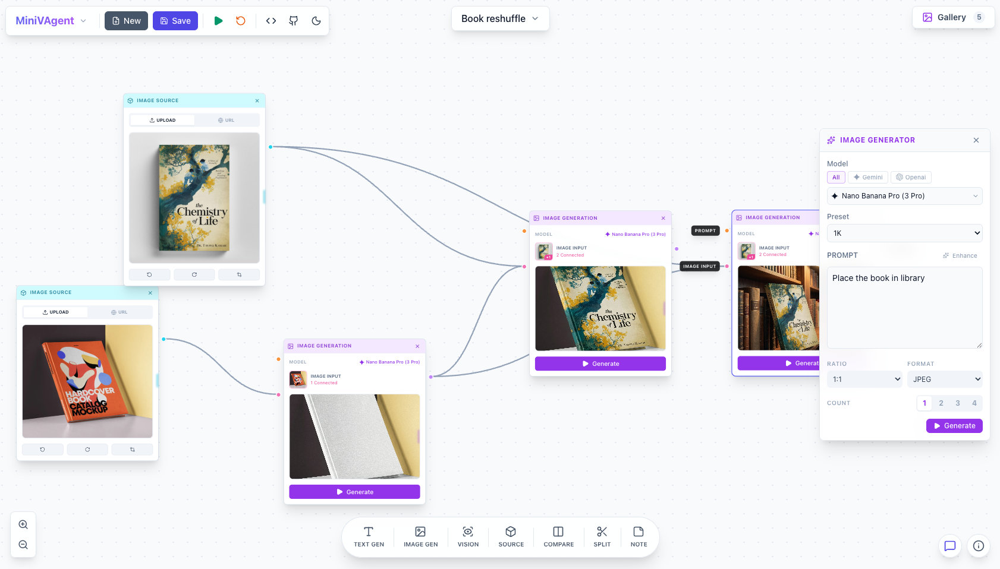
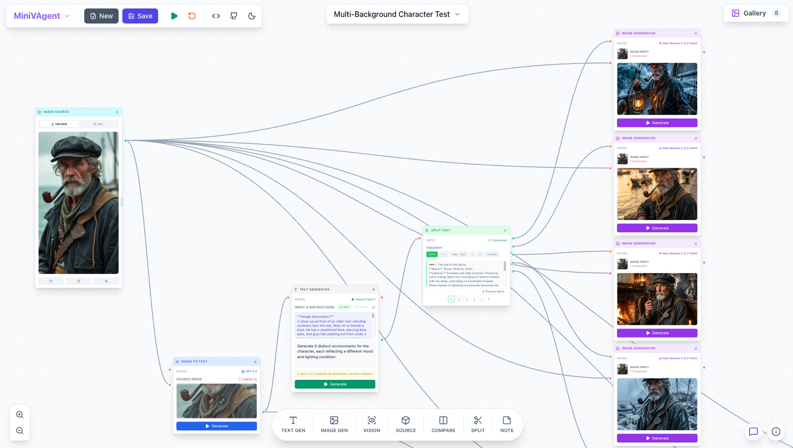

# MiniVAgent: Digital Alchemy Lab

MiniVAgent is a node-based workflow application powered by Nano Banana Pro for building AI-driven image and text pipelines. Create flexible generation flows by connecting nodes on a visual canvas, leveraging Google Gemini models and other modern AI tools.

[](https://snyk.io/test/github/bmustata/minivagent)





### Features

- **Visual Node Editor**: Drag-and-drop interface for building AI workflows
- **Multiple Node Types**:
    - Text Generation (Gemini Flash 2.5, Gemini Flash 3, GPT-5.4)
    - Image Generation (Nano Banana 1, Nano Banana Pro, Nano Banana 2, Imagen 4, GPT Image 1 / 1.5)
    - Vision/Image-to-Text Analysis
    - Image Source (URL or Upload)
    - Note/Documentation Nodes
- **Prompt Enhancement**: Optional AI-powered prompt optimization
- **Flow Execution**: Run individual nodes or entire workflows
- **AI Flow Assistant**: Natural language graph builder
- **Sample Workflows**: Pre-built examples to get started
- **CLI Support**: Execute graphs from command line for automation

## Quick Start

### Prerequisites

- Node.js (v18 or higher)
- A Gemini API key (required) or OpenAI API key (optional)

### Quick Start

1. Clone the repository and install dependencies:

    ```bash
    git clone https://github.com/bmustata/minivagent.git
    cd minivagent
    npm install
    npm run dev
    ```

2. Create a `.env.local` file in the root directory:

    ```
    GEMINI_API_KEY=your_gemini_api_key_here  # Required for base functionality
    OPENAI_API_KEY=your_openai_api_key_here  # Optional
    ```

    Get your Gemini API key from [https://aistudio.google.com/api-keys](https://aistudio.google.com/api-keys).

    Get your OpenAI API key from [https://platform.openai.com/api-keys](https://platform.openai.com/api-keys).

    > **⚠️ Security Warning:** Never commit `.env.local` or any file containing your API key to version control. It is already included in `.gitignore`.
    > Keep your key private — anyone with access to it can make requests billed to your account.

### Run Locally

**Development Mode (Hot Reload):**

```bash
npm run dev
```

Then open http://localhost:3202 in your browser.

- UI (Vite Dev Server): http://localhost:3202
- API Server: http://localhost:3201/api/

**Compiled Mode (Production Build + Watch):**

```bash
npm run dev:compiled
```

Then open http://localhost:3201 in your browser.

- UI (Static Build): http://localhost:3201
- API Server: http://localhost:3201/api/

> **Note:** In development mode, Vite runs the client on port 3202 with hot-module replacement. In compiled mode, the client is built to `/dist` and served by Express on port 3201.

## Usage

1. **Build Workflows**: Drag nodes from the toolbar onto the canvas
2. **Connect Nodes**: Click and drag from output handles (right) to input handles (left)
3. **Configure**: Click nodes to edit prompts and settings
4. **Execute**: Click the play button on individual nodes or run the full flow
5. **View Results**: Generated images appear in a gallery modal
6. **AI Assistant**: Use the Flow Assistant to describe a workflow in natural language and auto-build the graph

## Documentation

- [API Endpoints Reference](docs/api-endpoints.md)
- [Node Types Reference](docs/node-types.md)
- [Supported Models](docs/supported-models.md)
- [Graph ID Conventions](docs/graph-id-conventions.md)
- [Project Structure](docs/project-structure.md)

## Node Types

<table>
<thead>
<tr style="background-color:#f0f0f0"><th>Type</th><th>Purpose</th></tr>
</thead>
<tbody>
<tr style="background-color:#ffffff"><td>Text Generator</td><td>Generate or transform text using AI; supports prompt enhancement (Gemini, OpenAI)</td></tr>
<tr style="background-color:#f7f7f7"><td>Image Generator</td><td>Generate images from text prompts and optional reference images; supports aspect ratio, output format (JPEG/PNG) (Gemini, OpenAI)</td></tr>
<tr style="background-color:#ffffff"><td>Vision / Image-to-Text</td><td>Analyze or describe images using AI (Gemini, OpenAI)</td></tr>
<tr style="background-color:#f7f7f7"><td>Image Source</td><td>Load or upload a reference image (URL or file upload)</td></tr>
<tr style="background-color:#ffffff"><td>Note</td><td>Add documentation, prompts, or plain text that can feed into other nodes</td></tr>
<tr style="background-color:#f7f7f7"><td>Compare</td><td>Side-by-side comparison of two images with passthrough outputs</td></tr>
<tr style="background-color:#ffffff"><td>Split Text</td><td>Split text into parts by a separator — ideal for creating multiple variations of scenes, products, descriptions, and more</td></tr>
</tbody>
</table>

## Important Limitations

This project is intentionally minimal and designed for local use only. Please review the following constraints before deploying:

- **Local-Only Usage**: Built to run on a local machine or within a private network. Not intended to be exposed to the public internet.
- **No Authentication or Authorization**: The application does not implement any authentication or access control mechanisms.
- **Single-User Design**: No concept of multiple users, roles, or tenants. The system assumes a single-user environment.

## License

MiniVAgent is released under the [Apache 2.0 License](LICENSE) and encourages all types of contributions. No contribution is too small, and we want to thank all our community contributors.
